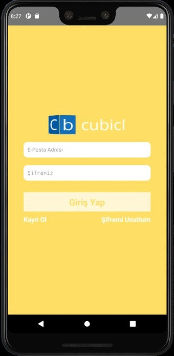

# CubiclFirstProject

> React Native Eğitimi 2: React Native'de Genel Yapı
>
> Eğitmen: Çağlar Keskin
>
> > [Youtube](https://www.youtube.com/playlist?list=PLVC2E6Si8ML4g7yOhVtVYxEq1ArFhiNN-)

Bu proje başlangıç düzeyinde React Native bileşenleri ve bileşenlerin stillendirilmesi hakkında bilgi sağlar.

